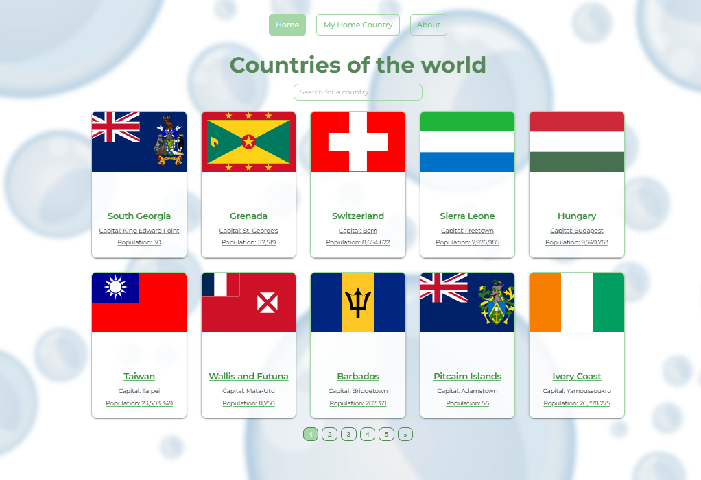
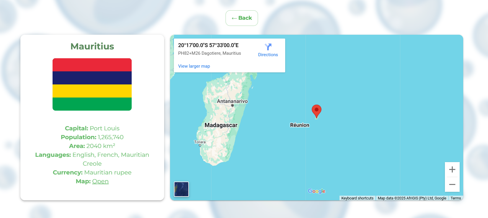
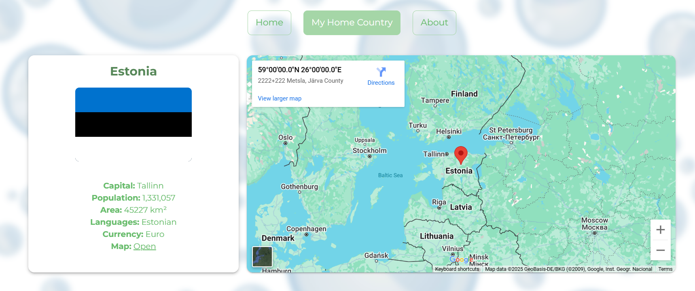

# Maailma riigid

React-põhine veebirakendus, mis kuvab teavet maailma riikide kohta, kasutades [REST Countries API](https://restcountries.com/).  

Projekt loodi veebiprogrammeerimise kursuse raames ning demonstreerib teadmisi Reacti funktsionaalsetest komponentidest, hookidest, marsruutimisest ja UI-teekidest.

## Funktsionaalsus

- Riikide otsimine nime järgi
- Riigi põhiteabe kuvamine: lipp, nimi, pealinn, rahvaarv
- Üksikasjalik info iga riigi kohta eraldi lehel
- Sisseehitatud Google Maps kaart
- “Minu koduriik” funktsioon
- Materjal-UI abil loodud vastutulelik disain
- Lehekülgede kaupa kuvamine (pagineerimine)

## Kasutatud tehnoloogiad

- [React](https://reactjs.org/)
- [React Router](https://reactrouter.com/)
- [Material UI (MUI)](https://mui.com/)
- [REST Countries API](https://restcountries.com/)
- Google Maps (iframe)

## Ekraanipildid

_Avaleht kõigi riikidega_  


_Riigi detailvaade_  


_Minu koduriik_  


## Kuidas käivitada

1. Klooni repo `git clone https://github.com/JekaterinaShashkina/Project4_Countries.git`
2. Paigalda sõltuvust `npm install`
3. Käivita rakendus `npm run dev`
4. Rakendus avaneb aadressil `http://localhost:5173`.

## Projekti struktuur
```bash
src/
├── components/        # Taaskasutatavad komponendid (Header, CountryCard, jne.)
├── pages/             # Lehekomponendid (MainPage, CountryDetail)
├── theme/             # MUI teemaseaded
├── assets/            # Staatilised failid (taustapildid, lipud)
├── App.jsx
├── main.jsx
└── index.css
```

## Autor

Loodud Jekaterina Shashkina, 2025

Projekt "Arukad süsteemid ja rakendusinfotehnoloogia" eriala jaoks
